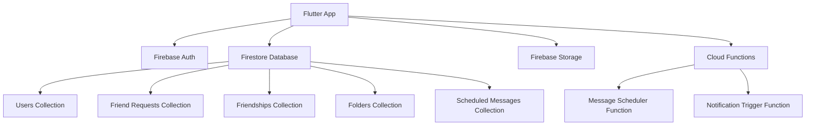

# Design Document

## Overview

This design document outlines the architecture for implementing social features in the Time Capsule Flutter application. The solution leverages Firebase Firestore for data storage, Firebase Storage for media files, Firebase Authentication for user management, and Firebase Cloud Functions for scheduled message delivery. The design follows the existing application patterns with clean separation between models, services, and UI components.

## Architecture

### High-Level Architecture



### Data Flow

1. **Friend Management**: Users search by username → Send friend requests → Accept/decline → Create bidirectional friendships
2. **Shared Folders**: Owner creates shared folder → Invites contributors → Contributors upload content → Owner locks folder
3. **Scheduled Messages**: User creates message with future date → Stored in Firestore → Cloud Function triggers delivery → Recipient receives notification
4. **Public Folders**: Owner marks folder as public → Folder becomes discoverable → Any user can view read-only content

## Components and Interfaces

### Models

#### FriendRequest Model
```dart
class FriendRequest {
  final String id;
  final String senderId;
  final String receiverId;
  final String senderUsername;
  final String? senderProfilePictureUrl;
  final FriendRequestStatus status;
  final DateTime createdAt;
  final DateTime? respondedAt;
}

enum FriendRequestStatus { pending, accepted, declined }
```

#### Friendship Model
```dart
class Friendship {
  final String id;
  final String userId1;
  final String userId2;
  final DateTime createdAt;
}
```

#### SharedFolder Model (Extension of existing FolderModel)
```dart
class SharedFolderData {
  final List<String> contributorIds;
  final String ownerId;
  final bool isLocked;
  final DateTime? lockedAt;
  final bool isPublic;
}
```

#### ScheduledMessage Model
```dart
class ScheduledMessage {
  final String id;
  final String senderId;
  final String recipientId;
  final String textContent;
  final String? videoUrl;
  final DateTime scheduledFor;
  final DateTime createdAt;
  final ScheduledMessageStatus status;
}

enum ScheduledMessageStatus { pending, delivered, failed }
```

### Services

#### FriendService
- `searchUsersByUsername(String query)`: Search users by username
- `sendFriendRequest(String receiverId)`: Send friend request
- `respondToFriendRequest(String requestId, bool accept)`: Accept/decline request
- `getFriendRequests()`: Get pending friend requests
- `getFriends()`: Get user's friends list
- `removeFriend(String friendId)`: Remove friendship

#### SharedFolderService (Extension of existing FolderService)
- `createSharedFolder(FolderModel folder, List<String> contributorIds)`: Create shared folder
- `inviteContributors(String folderId, List<String> userIds)`: Add contributors
- `removeContributor(String folderId, String userId)`: Remove contributor
- `lockFolder(String folderId)`: Lock folder from further contributions
- `makePublic(String folderId)`: Make folder publicly viewable
- `getPublicFolders()`: Get list of public folders

#### ScheduledMessageService
- `createScheduledMessage(ScheduledMessage message)`: Create scheduled message
- `getScheduledMessages()`: Get user's scheduled messages
- `getReceivedMessages()`: Get messages delivered to user
- `cancelScheduledMessage(String messageId)`: Cancel pending message

### UI Components

#### Pages
1. **FriendsPage**: Main friends management interface
2. **FriendRequestsPage**: View and respond to friend requests
3. **AddFriendPage**: Search and add friends by username
4. **SharedFolderSettingsPage**: Configure shared folder settings
5. **ScheduledMessagesPage**: Create and manage scheduled messages
6. **PublicFoldersPage**: Browse public memory folders

#### Widgets
1. **FriendRequestCard**: Display friend request with accept/decline actions
2. **FriendListTile**: Display friend with profile picture and username
3. **ContributorSelector**: Multi-select widget for choosing contributors
4. **ScheduledMessageCard**: Display scheduled message details
5. **PublicFolderCard**: Display public folder preview

## Data Models

### Firestore Collections Structure

#### Users Collection (Existing - Extended)
```
users/{userId}
├── email: string
├── username: string (indexed)
├── profilePictureUrl: string?
├── createdAt: timestamp
├── updatedAt: timestamp
└── friendsCount: number (denormalized for performance)
```

#### Friend Requests Collection
```
friendRequests/{requestId}
├── senderId: string (indexed)
├── receiverId: string (indexed)
├── senderUsername: string
├── senderProfilePictureUrl: string?
├── status: string (pending|accepted|declined)
├── createdAt: timestamp
└── respondedAt: timestamp?
```

#### Friendships Collection
```
friendships/{friendshipId}
├── userId1: string (indexed)
├── userId2: string (indexed)
├── createdAt: timestamp
└── composite index on [userId1, userId2]
```

#### Folders Collection (Extended)
```
folders/{folderId}
├── name: string
├── userId: string (owner)
├── parentFolderId: string?
├── description: string?
├── coverImageUrl: string?
├── createdAt: timestamp
├── isShared: boolean
├── isPublic: boolean
├── isLocked: boolean
├── lockedAt: timestamp?
├── contributorIds: array<string>
└── media/{mediaId} (subcollection)
    ├── uploadedBy: string
    ├── uploadedAt: timestamp
    └── ... (existing media fields)
```

#### Scheduled Messages Collection
```
scheduledMessages/{messageId}
├── senderId: string (indexed)
├── recipientId: string (indexed)
├── textContent: string
├── videoUrl: string?
├── scheduledFor: timestamp (indexed)
├── createdAt: timestamp
├── status: string (pending|delivered|failed)
└── deliveredAt: timestamp?
```

## Error Handling

### Service Layer Error Handling
- **Network Errors**: Retry logic with exponential backoff
- **Permission Errors**: Clear user feedback with suggested actions
- **Validation Errors**: Client-side validation with server-side verification
- **Storage Errors**: Graceful degradation for media upload failures

### UI Error Handling
- **Loading States**: Skeleton screens and progress indicators
- **Error States**: User-friendly error messages with retry options
- **Offline Support**: Cache friend lists and show offline indicators

### Security Error Handling
- **Authentication Errors**: Redirect to login with context preservation
- **Authorization Errors**: Clear messaging about insufficient permissions
- **Data Validation**: Sanitize all user inputs and validate on both client and server

## Testing Strategy

### Unit Tests
- **Model Tests**: Serialization/deserialization, validation logic
- **Service Tests**: Mock Firebase services, test business logic
- **Utility Tests**: Input validation, error handling functions

### Integration Tests
- **Friend Flow**: Complete friend request and acceptance flow
- **Shared Folder Flow**: Create, invite, contribute, and lock folder
- **Scheduled Message Flow**: Create, schedule, and deliver message
- **Public Folder Flow**: Make public, discover, and view folder

### Widget Tests
- **Page Tests**: User interactions, state management
- **Component Tests**: Individual widget behavior
- **Navigation Tests**: Route handling and parameter passing

### End-to-End Tests
- **Multi-User Scenarios**: Test interactions between different users
- **Real Firebase**: Test against Firebase emulator suite
- **Performance Tests**: Large friend lists, media uploads

## Security Considerations

### Firestore Security Rules

#### Friend Requests
```javascript
// Users can only read their own sent/received requests
match /friendRequests/{requestId} {
  allow read: if request.auth != null && 
    (resource.data.senderId == request.auth.uid || 
     resource.data.receiverId == request.auth.uid);
  allow create: if request.auth != null && 
    request.auth.uid == resource.data.senderId;
  allow update: if request.auth != null && 
    request.auth.uid == resource.data.receiverId &&
    resource.data.status == 'pending';
}
```

#### Shared Folders
```javascript
// Contributors can read/write, others can read if public
match /folders/{folderId} {
  allow read: if request.auth != null && 
    (resource.data.userId == request.auth.uid ||
     request.auth.uid in resource.data.contributorIds ||
     resource.data.isPublic == true);
  allow write: if request.auth != null && 
    (resource.data.userId == request.auth.uid ||
     (request.auth.uid in resource.data.contributorIds && 
      resource.data.isLocked == false));
}
```

#### Scheduled Messages
```javascript
// Users can only access their own sent/received messages
match /scheduledMessages/{messageId} {
  allow read, write: if request.auth != null && 
    (resource.data.senderId == request.auth.uid || 
     resource.data.recipientId == request.auth.uid);
}
```

### Data Privacy
- **Username Search**: Limit search results to prevent user enumeration
- **Friend Lists**: Only show mutual friends to non-friends
- **Public Folders**: Owner can revoke public access at any time
- **Scheduled Messages**: Encrypt sensitive content before storage

### Rate Limiting
- **Friend Requests**: Maximum 10 requests per day per user
- **Search Queries**: Rate limit username searches
- **Media Uploads**: Size and frequency limits for shared folders
- **Message Scheduling**: Limit number of pending scheduled messages

## Performance Optimizations

### Caching Strategy
- **Friend Lists**: Cache locally with periodic refresh
- **Public Folders**: Implement pagination and lazy loading
- **Media Thumbnails**: Generate and cache thumbnails for quick loading
- **Search Results**: Cache recent search results

### Database Optimization
- **Composite Indexes**: Optimize queries for friend relationships
- **Denormalization**: Store friend counts and folder statistics
- **Batch Operations**: Group related writes for better performance
- **Query Limits**: Implement pagination for large datasets

### Storage Optimization
- **Image Compression**: Compress images before upload
- **Video Processing**: Generate thumbnails and optimize video files
- **CDN Integration**: Use Firebase Storage CDN for global distribution
- **Cleanup Jobs**: Remove orphaned files from deleted folders